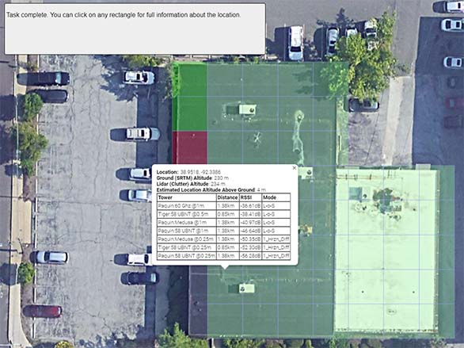

# RF_Signals

This is a long-term project for my employer, [iZones](https://izones.net/). They kindly gave me permission to open source a big chunk of our wireless planning software. We're a WISP (Wireless Internet Service Provider), and hope this helps other WISPs to succeed.

This project is divided into three parts:

* *rf_signal_algorithms* is a pure Rust port of [Cloud-RF/Signal Server](https://github.com/Cloud-RF/Signal-Server)'s algorithms. In turn, this is based upon SPLAT! by Alex Farrant and John A. Magliacane. I've retained the GPL2 license, because the parent requires it.
* *terrain-cooker* reads `las` files (LiDAR point clouds) and converts them into `bheat` files for efficient processing inside `bracket-heat`.
* *bracket-heat* is a web-based planning tool to help you decide if Wireless Internet installations are likely to work.

## Bracket-Heat

One of my early projects was WispTools.net, which used Longley-Rice/ITM (a lot of people thought it used Radio Mobile, but there's no connection other than similar algorithms). Bracket-Heat is a modernized version of the planner, designed for self-hosting.

When you first open `bracket-heat`, you are presented with a map showing your towers:


You can enter any address into the search box, and it runs a Google reverse geolocation to find the location and zoom in:


You can switch to satellite view, terrain view, etc. to help you find the location. You can click the "height" button at any time to see an overlay of your LiDAR data - great for checking that your data works, and getting an overview of the general area:


Once you've found the building, you can click on it to see a quick path/service estimate for the location:


From the quick path analysis window, you can click "location explorer" to examine a detailed (1m resolution) slice of the path from your chosen point to your towers:


You can also click "signal optimizer" to use a wizard to identify your target area, block off any parts you don't want to evaluate, and display a signal estimate grid for the target location:



We've had pretty good success cutting down on failed site surveys, and finding signal where we might not have expected it, with this tool. Hopefully, it can help your WISP, also.

## Ported Algorithms

This crate provides Rust implementations of a number of algorithms that are useful in wireless calculations:

* ITM3/Longley-Rice - the power behind Splat! and other functions.
* HATA with the COST123 extension.
* ECC33.
* EGLI.
* HATA.
* Plane Earth.
* SOIL.
* SUI.

Additionally, helper functions provide:

* Basic Free-Space Path Loss (FSPL) calculation.
* Fresnel size calculation.

## SRTM .hgt Reader

There's also an SRTM .hgt reader. You can get these from various places for pretty much the whole planet. See Radio Mobile for details. This will eventually be in its own feature. For now, it maintains an LRU cache of height tiles and tries to find the best resolution available to answer an elevation query.

An example query:

```rust
let loc = LatLon::new(38.947775, -92.323385);
let altitude = get_altitude(&loc, "resources");
```

This requires the `hgt` files from the `resources` directory to function.

## Porting Status

All algorithms started out in Cloud_RF's Signal Server (in C or C++) and were ported to Rust.

|Algorithm   |Status   |
|------------|---------|
|COST/HATA   |Ported to Pure Rust|
|ECC33       |Ported to Pure Rust|
|EGLI        |Ported to Pure Rust|
|Fresnel Zone|Pure Rust (not in original)|
|FSPL        |Pure Rust|
|HATA        |Ported to Pure Rust|
|ITWOM3      |Ported to Pure Rust|
|Plane Earth |Ported to Pure Rust|
|SOIL        |Ported to Pure Rust|
|SUI         |Ported to Pure Rust|

# So how do I use this?

If you want to use this yourself, there's a few steps to get going.

## Requirements

* You need a decently powerful PC to host it. We use a 12-core Xeon server with lots of storage, but it runs fine on my development laptop (i7, 12 gb RAM, 1 tb SSD).
* You'll need to obtain `.hgt` format data for your coverage area. These are the same files used by Splat! and Radio Mobile. You can also take various DEM files and convert them to HGT tile format. It supports all three popular resolutions of hgt file.
* You need LiDAR `.las` files for your coverage area. Your county assessor, or state land-grant university probably has them. For Missouri, I obtain them from [MSDIS](https://msdis.maps.arcgis.com/apps/View/index.html?appid=276d7a04beef4bb2820a13b12a144598). You should be able to use any LiDAR file, so long as it is in LAS format, and in a cartographic projection supported by Proj.
* You'll probably want to have access to Linux (or Windows Services for Linux) for converting LiDAR files. PROJ is a bear to get running in Rust on Windows.

## Initial Setup

1. Make sure you have a fully working Rust installation, along with a C++ and Clang build chain working.
2. Clone this project (with `git clone`) to a directory on your computer.
3. Setup a directory that you want to use to store `bheat` files.
4. Make sure you know where you put your `hgt` and `las` files.
5. Modify `terrain_cooker/src/main.rs`. Change `LIDAR_PATH` to the directory in which you are storing your `.las` files. 
6. In `terrain_cooker/src/tile_writer.rs` around line 48 change the base path to your `hgt` files.
7. In `terrain_cooker/src/tile_writer.rs` around line 110 change the output directory to where you want to save `bheat` files.

(**Note**: this will be made configurable without recompiling soon, promise).

## Cook some terrain

In your project directory, type `cd terrain-cooker`. Then run the conversion with `cargo run --release`. It will evaluate all `.las` files in the LIDAR folder, reading `.hgt` files from your heightmap directory and spit out `bheat` tiles. BHeat tiles start with a heightmap derived from your `hgt` files - and then adjust ground height and add terrain clutter heights from LiDAR files. This is an additive process: you can re-run it with new LiDAR data whenever you want, and the new data will be merged in.

## Add in your Google maps key

In `bracket-heat`, create a file named `gmap_key.txt` and paste your Google Maps API key into it. I didn't want to give you mine!

## Setup your WISP Information

1. Change to the `bracket-heat` directory.
2. Copy `resources/isp-template.ron` to `resources/isp.ron`.

The default file looks like this:

~~~ron
Wisp(
    listen_port: 8000,
    name: "iZones LLC",
    center: (38.947775, -92.323385),
    map_zoom: 10,
    heat_path: "z:/bheat",

    link_budgets: [
        LinkBudget(
            name: "Medusa + 450b HG",
            xmit_eirp: 49.0,
            receive_gain: 20.0
        ),
        LinkBudget(
            name: "UBNT 120° Sector + PowerBeam 400",
            xmit_eirp: 44.0,
            receive_gain: 25.0
        ),
    ],

    towers: [
        Tower(
            name: "Paquin",
            lat: 38.947927398900426,
            lon: -92.3233740822584,
            height_meters: 55,
            max_range_km: 16.0934,
            access_points: [
                AP(
                    name: "Medusa",
                    frequency_ghz: 3.6,
                    max_range_km: 16.0934,
                    link_budget: 71,
                ),
                AP(
                    name: "58 UBNT",
                    frequency_ghz: 5.8,
                    max_range_km: 16.0934,
                    link_budget: 69,
                ),
                AP(
                    name: "60 Ghz",
                    frequency_ghz: 60.0,
                    max_range_km: 3.21869,
                    link_budget: 97,
                )
            ],
        ),
        Tower(
            name: "Biggs",
            lat: 38.798403,
            lon: -92.289524,
            height_meters: 60,
            max_range_km: 16.0934,
            access_points: [
                AP(
                    name: "Medusa",
                    frequency_ghz: 3.6,
                    max_range_km: 16.0934,
                    link_budget: 71,
                ),
                AP(
                    name: "58 UBNT",
                    frequency_ghz: 5.8,
                    max_range_km: 16.0934,
                    link_budget: 69,
                ),
                AP(
                    name: "60 Ghz",
                    frequency_ghz: 60.0,
                    max_range_km: 3.21869,
                    link_budget: 97,
                )
            ]
        )
    ]
)
~~~

Make changes as you see fit:

* `listen_port` is the TCP port on which the webserver (Rocket) will listen.
* `name` just changes the title bar of the app, use it to brand with your WISP.
* `center` is the lat/lng position you want to see when you start the app.
* `map_zoom` is the zoom level at which you want to start when the app opens.
* `heat_path` must point at the `bheat` directory you created and populated with cooked data.
* `link_budgets` lets you define the types of radios you use, and wish to utilize when running RF calculations.
* `towers` describes all of your towers. It's important to add `AP` entries to them, describing what services are available at which location.

When you calculate the `link_budget` for an AP, take the transmitter's power and antenna gain and add them together. Then add the antenna gain of the CPE (NOT the power) you typically use.

## Run the program

Launch the program with `cargo run --release` in your `bracket-heat` directory. Open a browser to `http://localhost::<port>` (`<port>` being whatever you set as the `listen_port` in your config file). If everything works, you now have an RF analysis suite.
